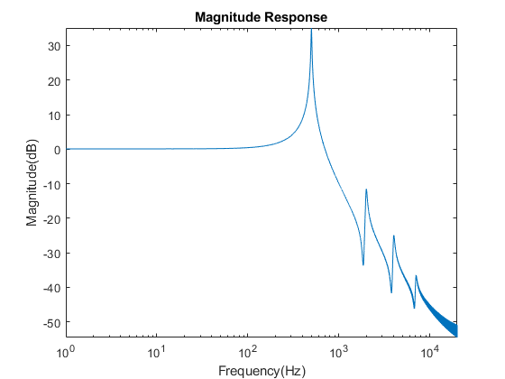
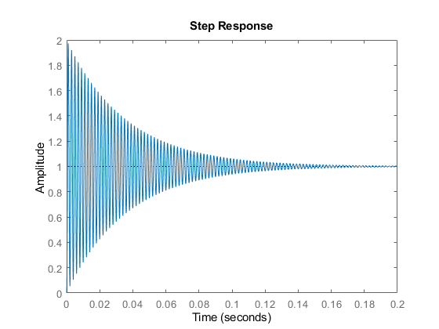
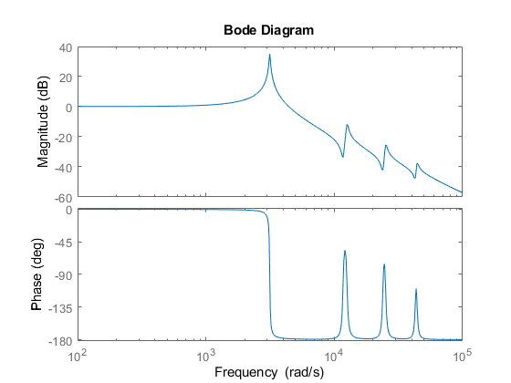

Stability, Controllability and Observabilty


```matlab:Code
eigen_values = eig(G.A)
```


```text:Output
eigen_values = 2x1 complex    
1.0e+03 *

  -0.0276 + 3.1414i
  -0.0276 - 3.1414i

```


```matlab:Code
figure 
pzmap(G)
```





```matlab:Code
% Controllability 
n = length(G.A)
```


```text:Output
n = 2
```


```matlab:Code
ctr = ctrb(G.A,G.B);
if rank(ctr) == n
    disp('  System is Controllable ')
else 
    disp('  System is not controllable ')
end
```


```text:Output
  System is Controllable 
```


```matlab:Code
%Observability 
obs = obsv(G.A,G.C);
if rank(obs) == n
    disp('  System is Observable ')
else 
    disp('  System is not Observable ')
end
```


```text:Output
  System is Observable 
```


```matlab:Code
stepinfo(G)
```


```text:Output
ans = 
        RiseTime: 3.3391e-04
    SettlingTime: 0.1410
     SettlingMin: 0.0538
     SettlingMax: 1.9728
       Overshoot: 97.2732
      Undershoot: 0
            Peak: 1.9728
        PeakTime: 0.0010

```


```matlab:Code
step(G)
```





```matlab:Code
% time simulation
%t = linspace(0,2,1000001);
F = 500; %Hz 
%y = 2*sin(2*pi*F*t);
%x = lsim(G,y,t);
[u,t] = gensig("square",100,200);
x = lsim(G,u,t);
```


```text:Output
Warning: The input signal is undersampled. Use a sampling period smaller than 4.9e-04.
```


```matlab:Code
figure 
plot(t,x,'red')
hold on
plot(t,u,'blue')
legend('Output','Input')
```




