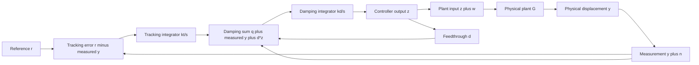

# Reproducible continuous-time baseline

## Model and units

`irc.py` assembles four second-order modes using the rounded coefficients in
the historical `sysID.md`. It does not repeat MATLAB's `tfest` identification
or claim its 99.9% estimation-data fit for this rounded model. The runner
compares its complex frequency response with `platform_resp.mat` and reports
`norm(model - measured) / norm(measured)`. This is an in-sample comparison,
not independent model validation.

Following the original MATLAB conversion, `Freq` is interpreted as Hz and
converted to rad/s for model evaluation. The measurement's calibration and
input/output engineering units are not documented in the source data. The
benchmark therefore assumes a normalized displacement-equivalent plant input
and output. A reference amplitude of `1e-9` is displayed as **1 equivalent nm**;
the computed plant input is not a voltage demand or a verified actuator limit.

## Signal definitions and feedback signs

Let `G` be the physical plant, `z` the controller output, `w` an additive
plant-input disturbance, `n` sensor noise, and `y = G(z + w)` physical output.
The artificial feedthrough is `d*z`; it is used inside the controller only.



With zero disturbance and noise:

```text
Cd = kd/s                 Ct = kt/s
H = Cd*G / (1 - Cd*(G+d))       physical inner-loop output / q
T = Ct*H / (1 + Ct*H)           physical output / reference
```

The implementation directly assembles the plant and integrator states:

```text
xdot = A*x + B*(z+w)
zdot = kd*(q + C*x + n + d*z)
qdot = kt*(r - C*x - n)
y = C*x
```

For damping only, replace `q` with `r`. For open loop, apply `r+w` directly
to the plant. `test_irc.py` checks the state-space response against the
independently evaluated rational expressions and checks every internal pole.
There are 8 plant states, 9 with damping, and 10 with tracking. No large
expanded transfer polynomials or hidden pole cancellations are used.

## Gains

For the lowest-frequency mode `a/(s^2+b*s+c)`, use `d=-2*a/c` and the historical
damping-gain expression. The historical tracking expression bounds the product
`kt*kd`, so the candidate tracking gain is:

```text
bound = -(a+d*c)/d^2
kt = 0.2 * bound / kd
```

The 0.2 factor is an explicitly chosen conservative starting point, not an
optimized setting. The original document's `[1]`/Lemma 2 reference has no
bibliographic entry, so this expression is not presented as a verified theorem
for the full model. Stability is checked numerically on the actual state matrix.
This baseline uses true integrators `k/s`, replacing the historical `k/(s+1)`
leaky implementation. No claim of optimality or universal stability is made.

## Reproduction and interpretation

Run `python run_analysis.py`. The runner writes:

- `metrics.csv`: periodic RMS/peak error, peak equivalent input, DC gain,
  approximate first -3 dB bandwidth relative to DC, 2% step settling time,
  and largest real part of an internal pole.
- `summary.json`: gains, complex model error, timestep convergence and 15
  parameter-sweep cases with fixed controller gains.
- `model_response.png`, `tracking.png`, `disturbance_noise.png`: frequency
  response comparison, physical-output tracking, and noise/disturbance transfer gains.

The reference is a 40 Hz triangle of amplitude 1 equivalent nm, simulated for
12 periods from zero state. Error metrics use the last four periods. The
nominal run uses 200 kHz time samples and compares against 400 kHz; it fails if
the maximum output difference exceeds 0.001 equivalent nm. These are simulation
time grids, not digital controller sample rates. Step settling uses 0.5 s of
data and a band around the final value, with null when not settled. Bandwidth
is an approximate grid crossing, not an assertion of flat tracking response.

The sensitivity grid varies all modal frequencies together from 0.8 to 1.2
times nominal and all damping ratios together by 0.5, 1 and 1.5, preserving
modal DC gains. It is an illustrative finite grid, not measured uncertainty,
independent modal variation or a robust-stability certificate.

## Remaining experimental work

- Record sensor/actuator calibration, measurement amplitude, acquisition
  conditions and repeat measurements for independent validation.
- Derive uncertainty ranges from those measurements; test independent modal
  perturbations, digital delay and the chosen implementation sample rate.
- Measure actuator voltage/rate limits before adding saturation and anti-windup.
- Identify hysteresis and creep before claiming nonlinear compensation.
- Supply the missing IRC reference and verify its assumptions against this setup.

The historical MATLAB exports and their saved plots remain available as an
archive. They are not regenerated or validated by the Python runner.
