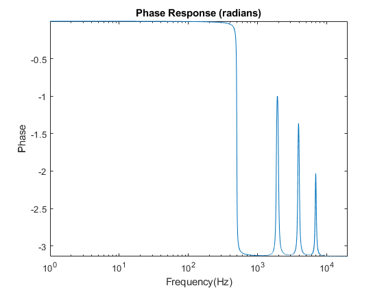
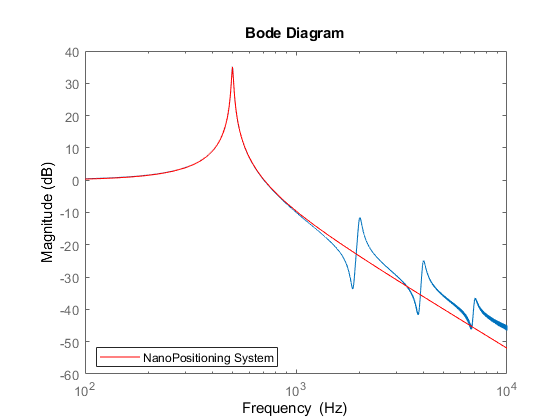
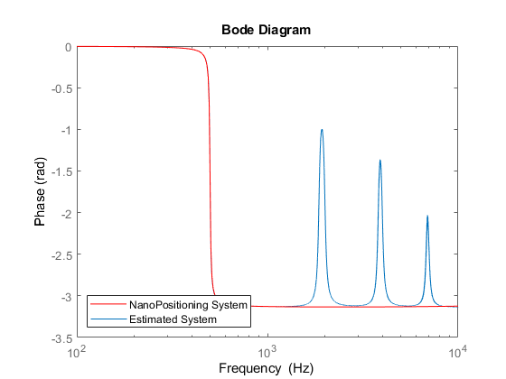
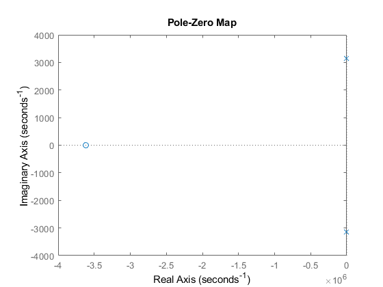

```matlab:Code
%%
clc
clear
load('platform_resp.mat');
```


```matlab:Code
Mag = abs(MagR);
Phase = angle(MagR);
```


```matlab:Code
figure
semilogx(Freq,20*log10(Mag));
xlabel('Frequency(Hz)')
ylabel('Magnitude(dB)')
axis('tight')
title('Magnitude Response')
```


```matlab:Code
figure
semilogx(Freq,Phase)
xlabel('Frequency(Hz)')
ylabel('Phase')
axis('tight')
title('Phase Response (radians)')
```





Create System from Frequeucy Response data, then use state space estimation to model system as a second order system from the dominant resonant pole


```matlab:Code
sys = frd(MagR,Freq*2*pi);
G = ssest(sys,2);
```


```matlab:Code
figure
opts = bodeoptions('cstprefs');
opts.PhaseVisible = 'off';
opts.FreqUnits = 'Hz';
semilogx(Freq,20*log10(Mag));
hold on 
bodeplot(G,opts,'red');
legend({'NanoPositioning System', 'Estimated System'},'Location','southwest')
```


```text:Output
Warning: Ignoring extra legend entries.
```





```matlab:Code
opts = bodeoptions('cstprefs');
opts.PhaseUnits = 'rad';
opts.MagVisible = 'off';
opts.FreqUnits = 'Hz';
semilogx(Freq,Phase);
hold on 
bodeplot(G,opts,'red');
legend({'NanoPositioning System', 'Estimated System'},'Location','southwest')
```





```matlab:Code
G % estimated state space system 
```


```text:Output
G =
  Continuous-time identified state-space model:
      dx/dt = A x(t) + B u(t) + K e(t)
       y(t) = C x(t) + D u(t) + e(t)
 
  A = 
           x1      x2
   x1  -27.65    1571
   x2   -6283  -27.65
 
  B = 
            u1
   x1  0.01844
   x2    73.08
 
  C = 
            x1       x2
   y1    85.98  0.01567
 
  D = 
       u1
   y1   0
 
  K = 
       y1
   x1   0
   x2   0
 
Parameterization:
   FREE form (all coefficients in A, B, C free).
   Feedthrough: none
   Disturbance component: none
   Number of free coefficients: 8
   Use "idssdata", "getpvec", "getcov" for parameters and their uncertainties.

Status:                                                
Estimated using SSEST on frequency response data "sys".
Fit to estimation data: 98.61%                         
FPE: 0.000428, MSE: 0.0004279                          
```


Stability, Controllability and Observabilty


```matlab:Code
eigen_values = eig(G.A)
```


```text:Output
eigen_values = 2x1 complex    
1.0e+03 *

  -0.0276 + 3.1414i
  -0.0276 - 3.1414i

```


```matlab:Code
figure 
pzmap(G)
```





```matlab:Code
% Controllability 
n = length(G.A)
```


```text:Output
n = 2
```


```matlab:Code
ctr = ctrb(G.A,G.B);
if rank(ctr) == n
    disp('  System is Controllable ')
else 
    disp('  System is not controllable ')
end
```


```text:Output
  System is Controllable 
```


```matlab:Code
%Observability 
obs = obsv(G.A,G.C);
if rank(obs) == n
    disp('  System is Observable ')
else 
    disp('  System is not Observable ')
end
```


```text:Output
  System is Observable 
```


```matlab:Code
% time simulation
t = linspace(0,2);
F = 500/(2*pi); %Hz 
y = sin(2*pi*F*t);
x = lsim(G,y,t);
figure 
plot(t,x)
hold on
plot(t,y)
```

